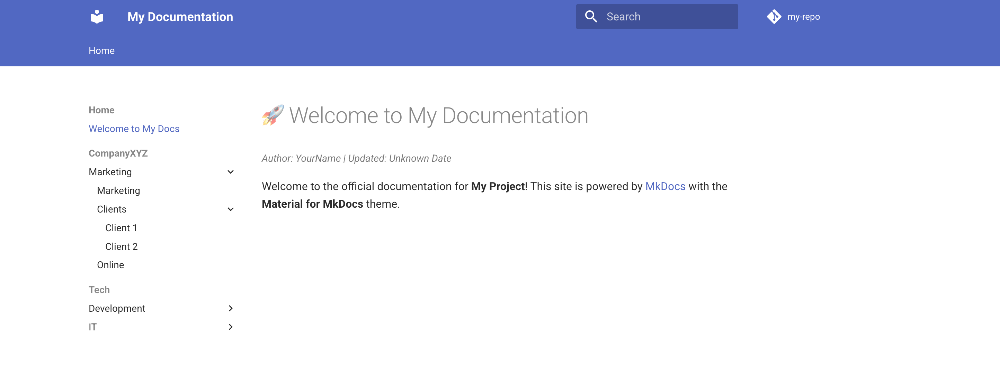

# Google Docs to Markdown downloader

This repository contains a proof-of-concept Python script that, given a Google Drive folder ID, downloads all Google Docs documents in Markdown format while preserving the folder structure.
Comments have been left throughout the code, with links to relevant documentation and hints of potential improvements.

## Why Download Google Docs content in Markdown format?

Many applications, both SaaS and self-hosted, allow users to take notes, journal, and manage documents. 
Google Docs is an excellent tool for document creation and synchronization across multiple devices and platforms. 
Additionally, it offers extensive APIs for interacting with Drive, Docs, and the broader Google Workspace suite.

This project explores the possibility of using Google Docs as a document editor while serving the exported Markdown content in a read-only format via a separate website.

This approach allows Google Docs to act as the primary editor, while external tools (e.g., MkDocs, Hugo, or Docusaurus) render and serve the exported Markdown files. 
A basic MkDocs setup is included as an example.

## Features 
- Downloads Google Docs documents as Markdown files.
- Maintains the original Google Drive folder structure.
- Downloads images embedded in the documents.
- Provides a simple MkDocs setup to preview the exported content.

## Setup

### 1. Obtain Google Credentials

To interact with the Google Workspace API, you'll need to create a Google Cloud project and obtain authentication credentials. 
Follow the official guide: [Google Drive API Quickstart (Python)](https://developers.google.com/drive/api/quickstart/python)..

Once you've set up the credentials, download the `credentials.json` file and place it inside the `src` folder.

### 2. Install Dependencies

From the `src` directory, set up a virtual environment and install the required dependencies:

```bash
python -m venv venv
source venv/bin/activate  # On Windows use `venv\Scripts\activate`
pip install -r requirements.txt
```

### 3. Run the Script

After configuring your credentials and updating the configuration file, edit to `main.py` file to provide the ID of the Google Drive folder you want to download the content from.

The script can be run by using:

```bash
python main.py
```

## Preview with MkDocs

A basic MkDocs setup is included to view the downloaded Markdown files in a structured format.

To build and run the MkDocs site using Docker:

```bash
docker compose up --build
```

This will start an instance of MkDocs, on [localhost:8000](localhost:8000), where you can preview the exported documents.
The configuration file is saved in the [./mkdocs/config/mkdocs.yml](./mkdocs/config/mkdocs.yml).

## Possible Improvements

Since this is a proof of concept, the following are potential improvements that could make it more useful, depending on your specific use case:

- containerize the python code and provide a schedule for the download function to run at 
- allow exporting the content in an s3 bucket, given its endpoint and credentials
- review the metadata that is exported from the Google documents and include it in the markdown headers and display it in the page headers
- menus in the MkDocs configuration file can be programmatically adjusted based on the files that have been downloaded and the folder structure

